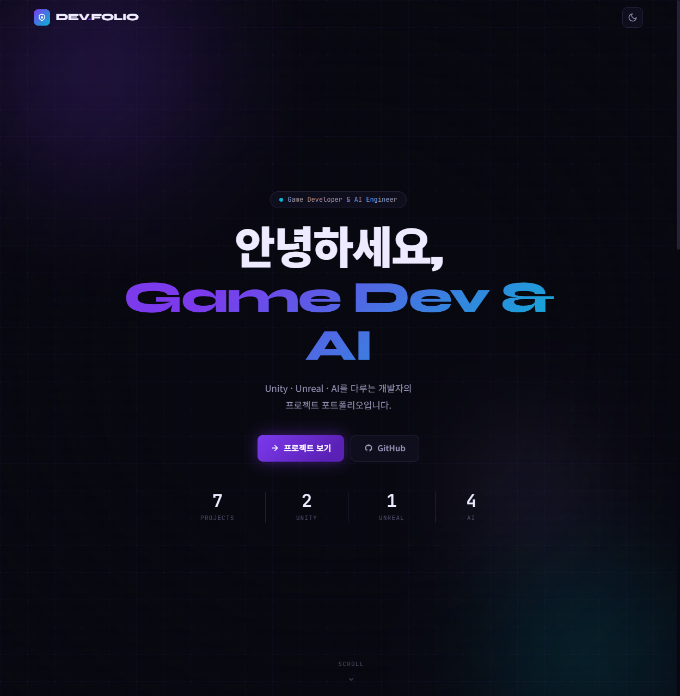
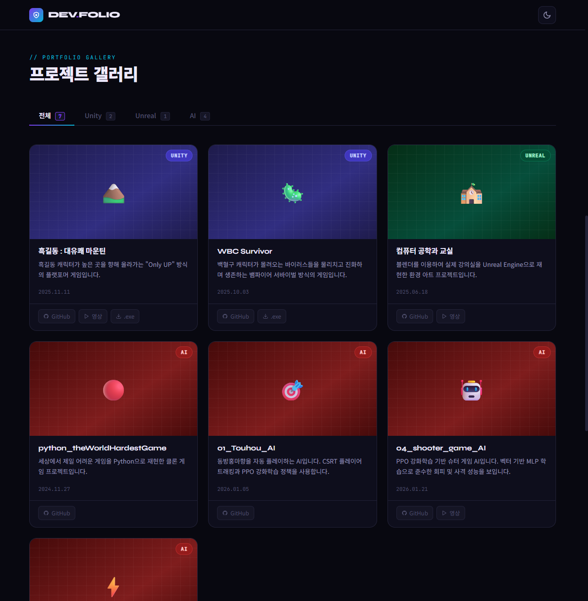

# DEV.FOLIO — Portfolio Site

> Game Developer & AI Engineer 포트폴리오 사이트

Unity · Unreal · AI · Web 프로젝트를 소개하는 개인 포트폴리오 사이트입니다.
단일 HTML 파일로 구성되어 있으며, 빌드 없이 GitHub Pages를 통해 바로 배포됩니다.

---

## 🔗 Live Demo

**→ [darkflame265.github.io/07_portfolio_site](https://darkflame265.github.io/07_portfolio_site)**

---

## 📸 Preview

| Hero | Projects |
|------|----------|
|  |  |

---

## ✨ Features

- **Hero 섹션** — 타이핑 이펙트, 메쉬 그라디언트 배경, 프로젝트 통계 카운터
- **프로젝트 갤러리** — Unity / Unreal / AI / Web 카테고리 탭 필터링
- **프로젝트 카드** — GitHub · 영상 · .exe · 사이트 링크 버튼, 호버 글로우 이펙트
- **기술 스택 섹션** — RPG 스타일 세그먼트 프로그레스 바, 스크롤 진입 애니메이션
- **다크 / 라이트 모드** — 토글 버튼으로 전환
- **반응형 레이아웃** — 모바일 · 태블릿 · 데스크톱 완전 지원
- **스크롤 애니메이션** — IntersectionObserver 기반 fadeUp 진입 효과
- **커스텀 favicon** — 사이트 로고 마크 SVG

---

## 🛠 Tech Stack

| 항목 | 내용 |
|------|------|
| 구조 | Vanilla HTML / CSS / JavaScript |
| 폰트 | [Syne](https://fonts.google.com/specimen/Syne) · [JetBrains Mono](https://fonts.google.com/specimen/JetBrains+Mono) · [Noto Sans KR](https://fonts.google.com/noto/specimen/Noto+Sans+KR) |
| 애니메이션 | CSS Keyframes · IntersectionObserver API |
| 배포 | GitHub Pages |

별도 프레임워크나 빌드 도구 없이 **단일 `index.html` 파일**로 동작합니다.

---

## 📁 File Structure

```
07_portfolio_site/
├── index.html      # 전체 사이트 (HTML + CSS + JS 포함)
├── favicon.svg     # 사이트 탭 아이콘
└── docs/
    └── PRD.md      # 프로젝트 기획 문서
```

---

## 🚀 Local Run

```bash
# npx serve 사용
npx serve .

# 또는 Python 사용
python -m http.server 3000
```

브라우저에서 `http://localhost:3000` 접속

---

## 🗂 Project Gallery

| 카테고리 | 프로젝트 |
|----------|----------|
| **Unity** | 흑길동 : 대유쾌 마운틴, WBC Survivor |
| **Unreal** | 컴퓨터 공학과 교실 |
| **AI** | python_theWorldHardestGame, 01_Touhou_AI, 04_shooter_game_AI, 05_avoid_game_AI |
| **Web** | Path Clash |
